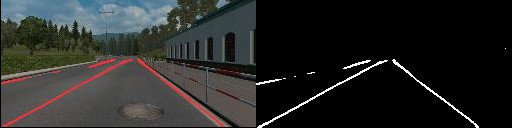
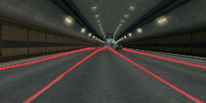

# Euro Truck Simulator 2 Autoban Auto-pilot

Lane detection ML training on Euro Truck Simulator 2 (ETS2).





A small article is also published here: MEDIUM LINK HERE
<br />

### Kudos First
This repository/tutorial is heavily fed by the following sources;  
1. tvtLANE Dataset  
Please check `docs/tvtLaneDataset.pdf`
2. @quinnzou  
https://github.com/qinnzou/Robust-Lane-Detection
3. Sentdex  
    1. https://pythonprogramming.net/game-frames-open-cv-python-plays-gta-v/  
    2. https://www.youtube.com/user/sentdex


<br />

## Table of Contents
1. [Roadmap](#roadmap)
2. [Requirements](reqs)
3. [Configuration](config)
4. [Basic](basics)
5. [Citation](citation)
7. [Social Media](social)

---

<a name="roadmap"></a>

## 1. Roadmap
1. **Lane Detection**  
    1.1. Use a pre-trained model from real-life for lane detection. (OK)  
    1.2. Create a dataset from ETS2  (OK)  
    1.3. Train a model with ETS2 data  (TODO)  
    <br />
2. **Steering**  
    1.1. Train steering data (TODO)  
    <br />
3. **Object Detection**  
    1.1. Environment awareness (TODO)  
    1.2. Braking (TODO)  

---

<a name="reqs"></a>

## 2. Requirements
1. Python >= 3.6 and PIP3  
2. CUDA >= 8
3. Euro Truck Simulator 2  
This is optional. You can try this with other games.

Run the following command to install all required libraries:  
```
pip3 install -r requirements.txt
```

This project is currently only supported on Linux/Ubuntu.    
If you are going to work on Windows environments, it is required to make some changes to grab screen and send button commands.  
Feel free to contribute for Windows support.

---

<a name="config"></a>

## 3. Configuration
1. Application Configuration  
Please refer to `config.py` for dataset settings, screen positioning, paths and more.  
Application arguments are located in this file.
2. Euro Truck Simulator 2  
Windowed mode (1280x720 is used in this project), front camera (button 6), auto wheel positioning, sensitivity adjustments. All for your consideration.  
3. Model  
If you are going to use a pretrained model, download it and move it under ./model and validate pretrained_path in config.py. Please refer to `./model/pretrained.txt`

---

<a name="basics"></a>

## 4. Basics
<br/>

### Creating a dataset from ETS2
```
python3 dataset_creator.py
```
A sequence of images from ETS2 will be created under ```./data/testset/ets2_...```  
All images will be scaled, cropped and ready for the model.  
Do not forget to remove unnecessary captures while you are switching windows.  
Basically, check the images inside first and last 2 created folders.
<br/>
<br/>

### Training the dataset
After the sequence of images are ready to be trained, first create an index file.
```
python3 dataset_indexer.py {FOLDER}
```
If your GPU is not powerful enough, please refer to `./model/pretrained.txt`  
Before running the command below, make sure you have entered correct folder names like explained in `config.py`  
```
python3 train.py
```
<br/>

### Test the model
When your model is ready as trained or pretrained and GPU power, test your model with `test.py`  
If you are just want to test with a pretrained model, go to the next step.
```
python3 test.py
```  
<br/>

### Single Capture Mode
<br/>

1. Run ETS2 and position it to top left screen and validate your screen positioning configuration.
2. Start the game with camera option 6 (front camera, no truck visuals)
3. Run the following command:
```
python3 live.py --mode=0 --continuous=False
```
A the moment, just 1 mode is available.  
Not a solution but for practice and experiement, HoughLinesP method and small geometry calculations only for testing purposes.  

Understanding the lines in model's matrix is work in progress. Please refer to the article.  
<br/>

### Continuous Capture Mode
<br/>

Follow first and second setup in 'Single Capture Mode' and run the following command:  
```
python3 live.py --mode=0 --continuous=True
```

Check the video below out; with mode=0 and continuous=True:  
[](https://youtu.be/6AIwDh3W-g0)  

After mode 2 is ready, the update will take its place here also.  

---

<a name="citation"></a>

## 5. Citation
1. Q. Zou, H. Jiang, Q. Dai, Y. Yue, L. Chen, Q. Wang  
Robust Lane Detection from Continuous Driving Scenes Using Deep Neural Networks, IEEE Transactions on VehicularTechnology, 2019.  
2. TuSimple lane-detection dataset.  http://benchmark.tusimple.ai/#/t/1/datase


---

<a name="social"></a>

## 6. Social Media
Linkedin: [lotdcotw](https://www.linkedin.com/in/lotdcotw/)  
Youtube: [lotdcotw](https://www.youtube.com/channel/UCWh19xX-0WBvzrlEG5gYh-Q)  
Twitter: [lotdcotw](https://twitter.com/lotdcotw)  
Instagram: [lotdcotw](https://instagram.com/lotdcotw)  
Facebook: [lotdcotw](https://www.facebook.com/lotdcotw/)  
